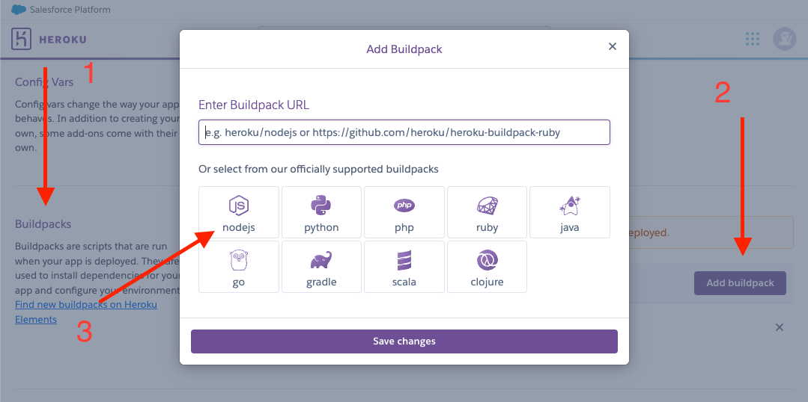
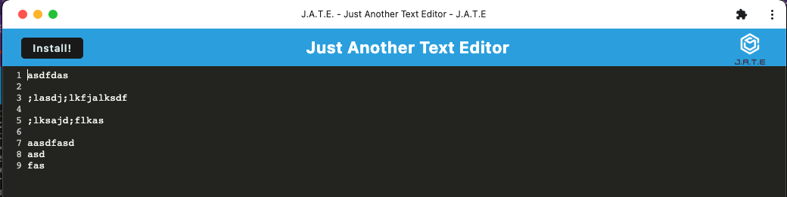

# 19 Progressive Web Applications (PWA): Text Editor

## Your Task

As you have progressed through this course, you have put together a number of impressive projects that you can show off to potential employers. This project is no exception; in fact, it features some of the most impressive expressions of the concepts you have learned so far.

Your task is to build a text editor that runs in the browser. The app will be a single-page application that meets the PWA criteria. Additionally, it will feature a number of data persistence techniques that serve as redundancy in case one of the options is not supported by the browser. The application will also function offline.

To build this text editor, you will start with an existing application and implement methods for getting and storing data to an IndexedDB database. You will use a package called `idb`, which is a lightweight wrapper around the IndexedDB API. It features a number of methods that are useful for storing and retrieving data, and is used by companies like Google and Mozilla.

You will deploy this full-stack application to Heroku using the [Heroku Deployment Guide on The Full-Stack Blog](https://coding-boot-camp.github.io/full-stack/heroku/heroku-deployment-guide).

## User Story

```md
AS A developer
I WANT to create notes or code snippets with or without an internet connection
SO THAT I can reliably retrieve them for later use
```

## Acceptance Criteria

```md
GIVEN a text editor web application
WHEN I open my application in my editor
THEN I should see a client server folder structure
WHEN I run `npm run start` from the root directory
THEN I find that my application should start up the backend and serve the client
WHEN I run the text editor application from my terminal
THEN I find that my JavaScript files have been bundled using webpack
WHEN I run my webpack plugins
THEN I find that I have a generated HTML file, service worker, and a manifest file
WHEN I use next-gen JavaScript in my application
THEN I find that the text editor still functions in the browser without errors
WHEN I open the text editor
THEN I find that IndexedDB has immediately created a database storage
WHEN I enter content and subsequently click off of the DOM window
THEN I find that the content in the text editor has been saved with IndexedDB
WHEN I reopen the text editor after closing it
THEN I find that the content in the text editor has been retrieved from our IndexedDB
WHEN I click on the Install button
THEN I download my web application as an icon on my desktop
WHEN I load my web application
THEN I should have a registered service worker using workbox
WHEN I register a service worker
THEN I should have my static assets pre cached upon loading along with subsequent pages and static assets
WHEN I deploy to Heroku
THEN I should have proper build scripts for a webpack application
```

## Description

First I reviewed the package.json files in the provided starter code to ensure I had the proper dependencies and scripts. After installing of those I began updating my webpack configuration file to add the necessary plugins, properly create my manifest to ensure PWA capability, and rules to render all of my files and run them through babel.

Next, I added asset caching logic to the service worker source file. Once caching was verified, I began to test and verify the connection to the IndexDB (and also local storage for the backup). The database.js and editor.js files needed some updates to properly talk to each other, but I was finally able to properly pull from storage upon pageload (and save to storage upon idle state or PWA download).

Finally, I built out my webpack and tested all features to satisfaction. After downloading the PWA application I confirmed that my stored results were still populating the application. The last step was to push all final updated to github and deploy via Heroku (both links can be accessed below).

## Heroku Issues

Heroku deployment was a difficult process, so detailed below are the steps I took to finally deploy correctly.

I first tried [all troubleshooting steps Heroku provides for Node.js](https://devcenter.heroku.com/articles/troubleshooting-node-deploys), and also copied into a fresh git repository [as suggested in this Stack Overflow article](https://stackoverflow.com/questions/65404309/heroku-error-during-git-push-deployment-the-same-version-of-this-code-has-alr/65436551#65436551).
Though these steps did not solve my issues, I suggest trying them if the steps below are unsuccessful.

Here are the steps I took to deploy successfully:

1. Within /client/package.json, I made 2 updates:

   - added the following to the package.json file:

   `"engines": { "node": "16.x" }`

   - moved all modules within "devDependencies" to "dependencies" object (my "devDependencies" object was empty upon successful deploy)

2. Created the Heroku app URL but _did not push code_ - `heroku create <app-name>` (e.g. `heroku create pwa-text-editor-DU-FS`)

3. In the "Settings" section of my Heroku app in the browser, I added the Node.js buildpack:
   

4. Pushed my production code with `git push heroku main`

## Deployment Details

Heroku Deployment: [PWA-Text-Editor - Heroku](https://pwa-text-editor-ang.herokuapp.com/)

Github: [PWA-Text-Editor - Github](https://github.com/alexgeis/PWA-Text-Editor)


